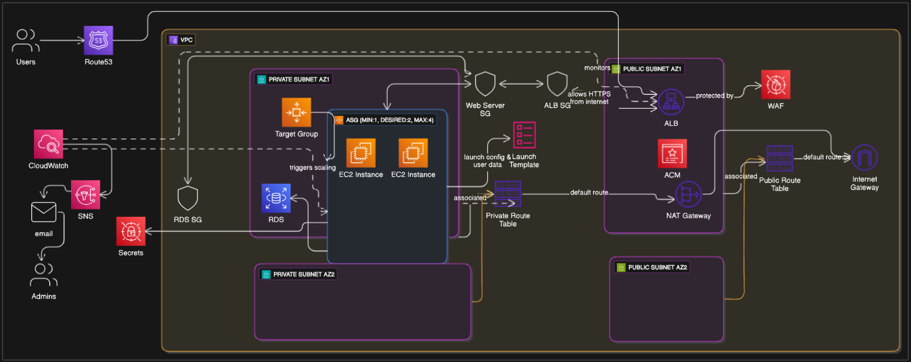

# Manara-aws-saa-Final-Project

## Project Documentation: Scalable Web Application with ALB and Auto Scaling

### 1. Introduction

The following documentation outlines the architecture and deployment of a highly scalable web application . The core components of this architecture are the Application Load Balancer and Auto Scaling Group , designed to ensure high availability and dynamic capacity management.

The goal of this project is to create a robust web application environment capable of handling varying traffic loads without manual intervention. By distributing incoming traffic across multiple instances using an ALB and automatically adjusting the number of instances based on demand using an ASG, the application maintains performance and minimizes downtime.

#### 1.1. Key AWS Services Utilized

* **Amazon EC2 (Elastic Compute Cloud):** Hosts the web application instances.
* **Amazon VPC (Virtual Private Cloud):** Provides a secure and isolated network environment.
* **Application Load Balancer (ALB):** Distributes incoming HTTPS traffic to targets (EC2 instances) at Layer 7.
* **Auto Scaling Group (ASG):** Manages the fleet of EC2 instances, ensuring optimal capacity and resilience.
* **EC2 Launch Template:** Defines the configuration for instances launched by the ASG.
* **Amazon CloudWatch:** Monitors performance metrics and triggers scaling and notification events.
* **Amazon SNS (Simple Notification Service):** Used for sending administrator notifications regarding scaling and alarms.
* **Amazon WAF (Web Application Firewall):** Used for security solution that protects web applications from various online threats.
* **Amazon ACM (AWS Certificate Manager):** Used for Provisionning SSL certificates for use with the ALB.
* **Amazon Route53 :** Used for DNS solution.
* **Amazon RDS (AWS Relational Database):** Used for backend data storage .
* **Amazon Secrets Manager :** Used for storing RDS credentials and pass it to EC2 instances  .
---

### 2. Architecture Overview

The architecture is designed for high availability across multiple Availability Zones (AZs) within a VPC.
Users access the application via a DNS endpoint provided by Route 53.

ALB (Application Load Balancer): Receives the traffic and distributes it across the available instances in the ASG. The ALB is typically placed in public subnets across multiple AZs.

Target Group: The ALB routes traffic to a Target Group, which consists of the EC2 instances managed by the ASG.

Amazon CloudWatch Alarms: Monitor metrics (e.g., CPU utilization, request count) to trigger ASG scaling policies.

---

### 3. Implementation Steps

The following steps detail the deployment process for the scalable web application.

#### 3.1. Network Infrastructure Setup
  - Create a VPC at least two public and two private subnets across two distinct Availability Zones.
  - Create 2 route tables one for public and one for private route.
  - Create an Internet Gateway (IGW) along with  NAT Gateway (located in a public subnet) for outbound internet access.
  - Create Application Load Balancer (ALB)
  - Create WAF and bound the ALB to it 
  - Create ACM certififcat to be added to the Listener to secure traffic 
  - Create 2 Security Groups one for ALB access and the other one for EC2 
      * ALB Security Group:
      
      Inbound: Allow HTTPS (Port 443) traffic from 0.0.0.0/0 (internet).
      
      Outbound: Allow traffic to the EC2 instances (Web Server Security Group).
      
      * Web Server Security Group:
      
      Inbound: Allow HTTPS (Port 443) traffic only from the ALB Security Group.
      
      Outbound: Allow necessary outbound traffic ( to databases).

#### 3.2. Storage and Configuration    
 - Create RDS instance to store Backend data 
 - Create a Secret in AWS secret Manager to store RDS credentials 

#### 3.3. Compute and Load Balancing Configuration
  - Create The Launch Template that defines the specifications for instances managed by the ASG along with User Data including a script [UserData] to automate application installation and configuration .
  - Create ASG (Desired: 2 ; Minimum: 1 ; Maximum: 4 ) with Target Tracking Scaling Policy use as metric CPUUtilization (for compute-bound apps) or RequestCountPerTarget (from ALB, for load-bound apps).
      The ASG ensures that a minimum number of instances are always running and scales out (adds instances) or scales in (removes instances) based on `load`.
  - Create target group pointing to ASG
  - Create listener with (HTTPS 443)
  - Associate the listener with the Target Group created above
  - Attach the SSL certificat created in Section 3.1 

### 3.4. Monitoring Configuration via CloudWatch Alarms

CloudWatch monitors the metrics of the ASG and ALB. We configure alarms to detect when thresholds are crossed.

1.  **Scaling Alarms:** Alarms are automatically created when setting up Target Tracking Scaling policies for the ASG. These trigger the ASG to scale out or in.
2.  **Application Health Alarms:** Create additional alarms for non-scaling related issues.
    * **Latency Alarm:** Monitor `ALB Latency` (e.g., trigger if latency exceeds 2 seconds for 5 consecutive minutes).
    * **HTTP 5xx Alarm:** Monitor `HTTPCode_Target_5XX_Count` (e.g., trigger if the count of server errors is greater than 0 for 1 minute).

### 3.5. Implement Admin Notifications using Amazon SNS

Amazon SNS is used to deliver notifications via email to administrators when critical events or scaling activities occur.

1.  **Create an SNS Topic:**
    * In the SNS console, create a new Standard Topic `ASG_Admin_Alerts`.
2.  **Create an SNS Subscription:**
    * Subscribe the administrator's email address to the new SNS Topic.
3.  **Associate Alarms with SNS Topic:**
    * Edit the CloudWatch Alarms created in Section 3.4
    * In the "Actions" section of the alarm, select "Send a notification."
    * Choose the `ASG_Admin_Alerts` SNS Topic.
